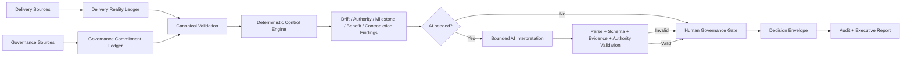

# Architecture

```mermaid
flowchart LR
  A[Delivery Sources] --> B[Delivery Reality Ledger]
  C[Governance Sources] --> D[Governance Commitment Ledger]
  B --> E[Canonical Validation]
  D --> E
  E --> F[Deterministic Control Engine]
  F --> G[Drift / Authority / Milestone / Benefit / Contradiction Findings]
  G --> H{AI needed?}
  H -- No --> J[Human Governance Gate]
  H -- Yes --> I[Bounded AI Interpretation]
  I --> K[Parse + Schema + Evidence + Authority Validation]
  K -- Invalid --> J
  K -- Valid --> J
  J --> L[Decision Envelope]
  L --> M[Audit + Executive Report]
```

## Trust principle
AI is downstream of deterministic evidence and upstream of mandatory validation/human governance for consequential decisions.
